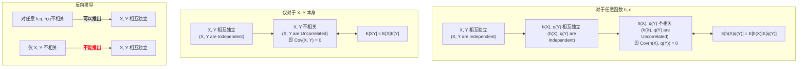

好的，这个问题提得非常好！这几个概念之间的逻辑关系确实是多元统计中最核心也最容易混淆的地方。

我们来制作一个清晰的总结图表和解释，把它们之间的所有推导关系一次性理清楚。

---

### **核心概念定义**

首先，我们明确一下三个核心概念的数学语言：

1.  **独立 (Independence)**:
    *   $X, Y$ 独立 $\iff$ $f_{XY}(x,y) = f_X(x)f_Y(y)$  (对于所有 $x,y$)
    *   或者等价地，$F_{XY}(x,y) = F_X(x)F_Y(y)$ (对于所有 $x,y$)

2.  **不相关 (Uncorrelated)**:
    *   $X, Y$ 不相关 $\iff$ $Cov(X,Y) = 0$

3.  **乘积的期望等于期望的乘积 (Product of Expectations)**:
    *   $E[XY] = E[X]E[Y]$

**重要关系**: 根据协方差的定义 $Cov(X,Y) = E[XY] - E[X]E[Y]$，我们可以立即看出：
**不相关 (Uncorrelated) $\iff$ 乘积的期望等于期望的乘积**
这两个概念是**完全等价**的，可以互相推导。所以我们可以把它们视为同一个概念的不同表述。

现在，我们的问题简化为梳理 **独立 (Independence)** 和 **不相关 (Uncorrelated)** 之间的关系。

---

### **逻辑关系总结图**

---

### **详细文字解释**

#### **第一部分：从强到弱的推导 (正向推导)**

这个方向的逻辑链条非常清晰，永远成立。

1.  **$X, Y$ 独立 $\implies$ $h(X), q(Y)$ 独立**
    *   **解释**: 这是最强的条件。如果两个随机变量是独立的，那么由它们各自构成的任何函数（比如 $X^2$ 和 $\sin(Y)$）也必然是独立的。因为 $X$ 的结果不提供任何关于 $Y$ 的信息，那么 $X^2$ 的结果自然也无法提供任何关于 $\sin(Y)$ 的信息。

2.  **$h(X), q(Y)$ 独立 $\implies$ $h(X), q(Y)$ 不相关 (即 $Cov(h(X), q(Y))=0$)**
    *   **解释**: 独立性是一个比不相关性强得多的概念。独立意味着两个变量在任何层面都没有关系，而协方差只衡量**线性关系**。没有关系，自然也就没有线性关系。所以这个推导永远成立。

3.  **$h(X), q(Y)$ 不相关 $\iff E[h(X)q(Y)] = E[h(X)]E[q(Y)]$**
    *   **解释**: 如前所述，这两个陈述在数学上是完全等价的，只是协方差定义式的两种写法。

**特例**: 当我们选择最简单的函数 $h(x)=x$ 和 $q(y)=y$ 时，上面的逻辑链就简化为：
**$X, Y$ 独立 $\implies$ $X, Y$ 不相关 $\iff E[XY] = E[X]E[Y]$**

#### **第二部分：从弱到强的推导 (反向推导)**

这是最容易产生混淆的地方，也是你提出疑问的关键。

1.  **$X, Y$ 不相关 ($Cov(X,Y)=0$) $\implies$ $X, Y$ 独立？**
    *   **答案：不能！(FALSE)**
    *   **解释**: 这是最经典的反例来源。零协方差仅仅意味着**没有线性关系**。两个变量之间可能存在非常强的**非线性关系**（比如 $Y=X^2$），但协方差却可能为零。

2.  **但是！$Cov(h(X), q(Y))=0$ 对于“任意”函数 $h, q$ 成立 $\implies$ $X, Y$ 独立？**
    *   **答案：可以！(TRUE)**
    *   **解释**: 这就是你上一张图片中那个证明的精髓。这个条件不再是仅仅一个关于 $X, Y$ 的零协方差条件，而是**无穷多个**零协方差条件。这个条件是如此之强，它排除了任何可能存在的非线性关系。证明过程就是通过巧妙地选取指示函数 $h(X)=\mathbf{1}(X \le x)$ 和 $q(Y)=\mathbf{1}(Y \le y)$，将这个强条件直接转化为了独立性的定义 $F_{XY}(x,y) = F_X(x)F_Y(y)$。

### **总结与记忆技巧**

*   **单向箭头**: **独立 $\implies$ 不相关**。可以想象成：独立是“绝交”，不相关是“不是线性朋友”。绝交了，肯定不是线性朋友；但不是线性朋友，不代表就绝交了，可能还是别的复杂关系（非线性关系）。

*   **“任意函数”是关键**: 看到 “**for any functions h(X) and q(Y)**” 这个短语，就要立刻警觉。它是一个“超级加强”的条件，把“不相关”这个弱概念提升到了和“独立”等价的强度。

*   **特殊情况：正态分布**: 如果你**已经知道** $(X,Y)$ 服从**二元正态分布 (Bivariate Normal Distribution)**，那么在这个特殊的世界里，**不相关 (Uncorrelated) 和 独立 (Independent) 是等价的**！这是正态分布一个非常优美和独特的性质。但在通用情况下，这个双向推导不成立。

希望这个总结能帮你把脑海中混乱的线索都理顺！如果还有任何不清楚的地方，随时可以继续问。